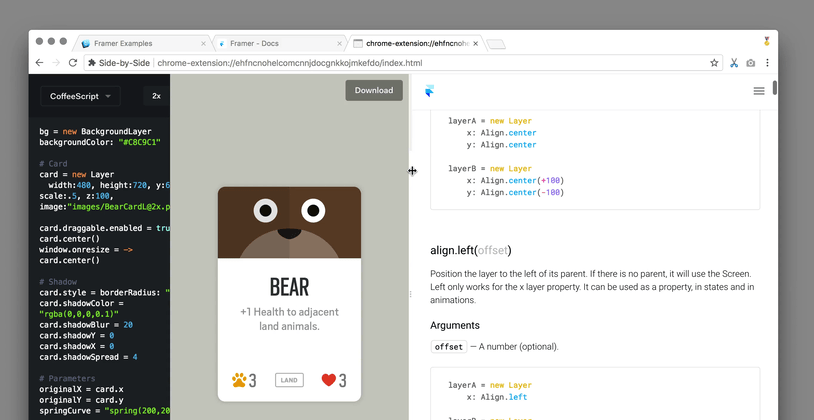
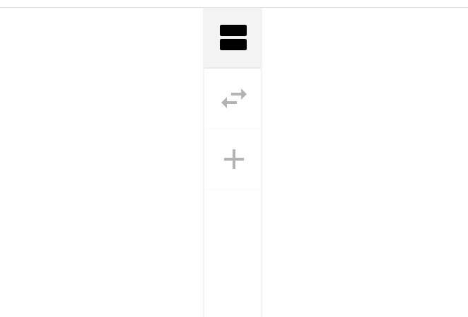
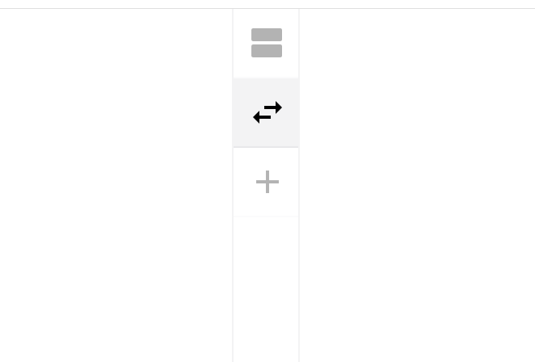
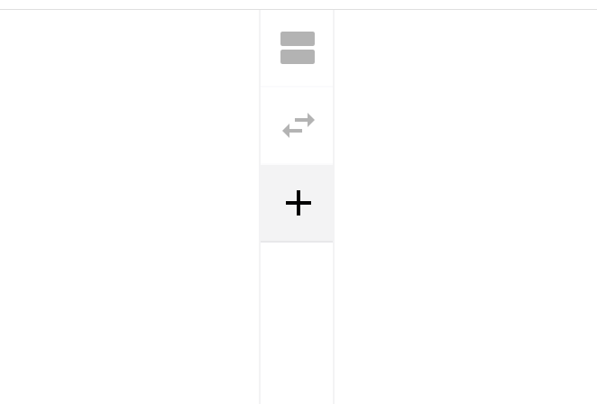

Side|Side
==============

### Load sites—side by side

[Install Extension](https://chrome.google.com/webstore/detail/side-by-side/bobidkladfnoamglfgpnllbkhjlhjlfb)

**Options**

A discrete options menu is located at the top (or left, depending on orientation) which allows the user to rotate the orientation, flip the position of panes, or add panes.

| Rotate orientation of panes—left/right or top/bottom.        | Flip position of panes.                              | Add a pane.                                        |
| ------------------------------------------------------------ | ---------------------------------------------------- | -------------------------------------------------- |
|  |  |  |

Build
-------------

| Command | Description |
|-|-|
| `$ npm run dev`   | Spin up Webpack watch task and development server ([0.0.0.0:1112](http://0.0.0.0:1112)) |
| `$ npm run build` | Compile (and uglify) only necessary files into .zip for upload to Chrome Extension Webstore |

TODOs
-------------

All TODOs, features, and bugs are tracked within [issues](https://github.com/frederickk/side-by-side/issues/).
